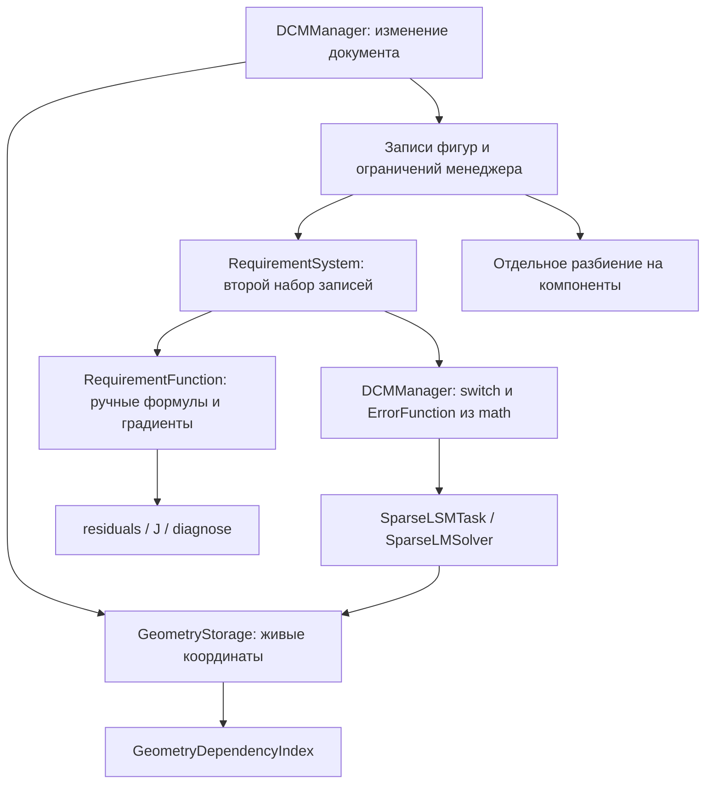
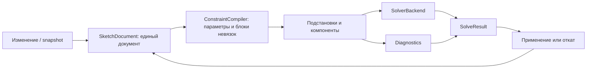

# Аудит OurPaintDCM — 1 октября 2026 года

Основной вывод: у проекта уже есть полезное ядро параметрического эскизника, но сейчас нельзя надёжно трактовать `solve() == true` как выполнение геометрических ограничений. Главная архитектурная проблема — несколько независимых представлений документа и две разные математические реализации ограничений. Сначала стоит исправить согласованность и критерии успеха, затем развивать диагностику, интерактивность и набор ограничений.

Аудит выполнен для DCM `fbe1fe6` и математического подмодуля `df9c1b382480875e8bbe8e6725af276f500d5bf2`. Производственные исходники не изменены. Добавлены этот отчёт, инвентаризация и воспроизводимые примеры.

**1. Объём проверки и фактическая верификация**

Инвентаризированы 148 отслеживаемых файлов: 73 в основном репозитории и 75 в `math`. Из них 124 файла C/C++, примерно 31 040 строк. В область аудита вошли API, все реализации DCM, геометрическое хранилище и индексы, математические модели, рабочий Sparse LM, альтернативные оптимизаторы, матрицы/QR/графы, тесты, CMake, CI, консоль, скрипты и документация. Внешние приложения, использующие библиотеку, в репозитории отсутствуют и не обследованы. Для больших наборов математических тестов использованы запуск и проверка соответствующих реализаций; это не доказательство отсутствия других дефектов.

Полный список файлов и их ролей: [FILE_INVENTORY.md](C:/Users/Killu/OneDrive/Desktop/ourpaintdcm/docs/audit/FILE_INVENTORY.md).

| Проверка | Результат |
|---|---|
| Отдельная свежая сборка Debug, MinGW GCC 16.2, Ninja | Собрана; повторная проверка сборки: `ninja: no work to do` |
| CTest из корня сборки | 30/30 тестовых исполняемых файлов прошли |
| CTest непосредственно из `math/tests`, без `perf` | 18/19 прошли; `LSMTaskTest` упал с `SegFault` |
| Самостоятельное включение каждого публичного заголовка DCM | 18/19 компилируются; `Components.h` не компилируется |
| Собственные примеры аудита | Подтвердили ошибки решения, компонент, формул, производных, диагностики и контрактов геометрии |
| Копирование и перемещение факторизованного `SparseQR`, отдельные процессы | Оба процесса аварийно завершились при `solve()` |

Для сборки повторно использованы уже загруженные исходники Eigen и GoogleTest; GoogleTest в этом локальном наборе — 1.12.1. Интернет-загрузка чистого набора зависимостей, MSVC/Clang/Linux, Release, Valgrind и длительные performance-тесты в этом аудите не запускались. В исходниках найдено 299 объявлений тестов DCM и 277 математических тестов; это счётчик объявлений, а не число выполненных тестов.

Доказательства сохранены в [build/audit](C:/Users/Killu/OneDrive/Desktop/ourpaintdcm/build/audit): `configure.log`, `build.log`, `ctest.log`, `math-ctest.log`, `repro-output.txt`, `header-checks.json`, `sparse-copy-output.txt`, `sparse-move-output.txt`, `inventory.json`.

**2. Что уже хорошо устроено**

- `GeometryStorage` хранит объекты через `unique_ptr`: рост контейнеров не перемещает сами точки и не ломает указатели на координаты.
- Есть отдельный индекс связей фигура → точки и точка → зависимые фигуры, плотные кэши перебора и повторное использование свободных слотов.
- Фасад `DCMManager` предоставляет CRUD, пакетные изменения, GLOBAL/LOCAL/DRAG, снимки и восстановление ID. Базовый механизм для внешнего undo/redo уже реализован.
- Совпадение точек сокращает число переменных через представителей, фиксация устраняет переменные из оптимизации. Это полезные структурные упрощения.
- Рабочий путь использует Sparse LM и кэширует построенную задачу. Есть тесты на фиксацию, изменение параметров, совпадение точек и перетаскивание.
- Лицензия проекта MIT; математика вынесена в отдельный репозиторий с закреплённым коммитом.

Эти решения стоит сохранить. Их проблемы связаны преимущественно с неполной согласованностью между слоями.

**3. Как сейчас проходит решение**



Дополнительно существуют старые классы `Requirements::*::toFunction()` и отдельная `RequirementFunctionFactory`. Менеджер их обходит. В итоге одну семантику приходится поддерживать в дескрипторах, нескольких `switch`, двух математических моделях, старом API и консольных командах.

**4. Подтверждённые ошибки, которые следует исправлять первыми**

`P1` означает дефект, способный дать неверную геометрию, ложный успех или аварийное завершение. `P2` — нарушение API, диагностики, интеграции или масштабирования. Это приоритеты данного аудита.

| № | Приоритет | Дефект и доказательство | Что исправить |
|---|---|---|---|
| B01 | P1 | При отсутствии свободных переменных `solve()` возвращает `true`, не проверяя ограничения. Две точки зафиксированы на расстоянии 1, требуемое расстояние 2: `true`, норма невязки 1. | Проверять все исходные ограничения после исключения переменных, включая противоречивые фиксации. |
| B02 | P1 | Sparse LM считает малый градиент/шаг достаточным для успеха. Расстояния 1 и 2 для одной пары точек: `true`, математическая ошибка 4.5, геометрическая невязка около 0.716. Две точки в одном месте при требуемом расстоянии 5: успех после 0 итераций, ошибка 625. | Разделить остановку оптимизатора и достижение геометрической точности; возвращать разные причины завершения. |
| B03 | P1 | Математическая формула `SectionCircleDistanceError` вообще исключает центр окружности и превращает радиус в константу. После изменения центра и радиуса значение функции не меняется. Также выражение использует `A^A`, `B^B` вместо квадратов. | Переписать ограничения окружности на единой модели с корректными переменными и геометрической семантикой. |
| B04 | P1 | Диагностика угла использует `cos(angle)` с радианами, рабочая функция возвращает угол в градусах. Для перпендикулярных линий и параметра 90: диагностика 0.448074, рабочая функция 0. | Явно определить единицу угла в API и использовать одну формулу. |
| B05 | P1 | `rebuildComponents()` связывает только объекты из ограничений, забывая зависимости фигур от точек. После восстановления снимка одна горизонтальная линия превращается из 1 компоненты в 3. Перетаскивание её точки оставляет разность Y равной −5. | Строить компоненты по зависимостям переменных/геометрии и ограничений; проверить удаление и восстановление. |
| B06 | P1 | Кэш Якобиана инвалидируется при добавлении функций, но не при изменении координат. После поворота пары точек из `(1,0)` в `(0,1)` `J()` остался прежним; отличие от пересчитанного J равно 2. | Разделить версии структуры и численных значений; перед численной диагностикой обновлять J. |
| B07 | P1 | `LineOnCircleFunction` складывает ошибки двух концов вместо выдачи двух уравнений. Концы на расстояниях 5 и 15 от центра при радиусе 10 дают нулевую невязку. | Ограничение должно выдавать вектор `[distance(p1,c)-r, distance(p2,c)-r]`. |
| B08 | P1 | Ручные градиенты перезаписывают вклад повторяющихся указателей. Две линии с общей точкой: производная параллельности по общей X аналитически 0, численно −1. | Суммировать вклады по одному параметру; проверять shared endpoints и aliases. |
| B09 | P1 | У `LineCircleDistanceFunction` неверен градиент при проекции за конец отрезка. Для линии `(0,0)-(2,0)` и центра `(3,1)` производная по X первого конца аналитически −0.707107, численно 0. | Перепроверить внутреннюю и обе граничные ветки расстояния до отрезка. |
| B10 | P1 | Конструкторы копирования и перемещения `SparseQR` не переносят все данные факторизации, включая `_r_diag` и CSC-кэши R. Оригинал решает диагональную систему с ответом `(1,1)`; копия и перемещённый объект падают. | Полностью переносить состояние либо запретить операции; добавить тест решения после copy/move/assignment. |
| B11 | P2 | Число переменных диагностики учитывает лишь параметры функций. Зафиксированная точка плюс отдельная свободная точка классифицируются как `WELL_CONSTRAINED`. | Диагностировать полный документ или явно обозначенную компоненту с полным набором параметров. |
| B12 | P2 | В аналитическом `LineCircleDistanceFunction` параметр `_distance` не вычитается. Геометрический зазор 2 и требуемый зазор 2 дают невязку 2. | Исправить остаток и тестировать параметр, центр и радиус независимо. |
| B13 | P2 | `residuals()` умножает на вес функции, а `J()` — нет. При весе 2 производная J равна −1, численная производная невязки −2. | Согласованно масштабировать residual и Jacobian, определить смысл веса. |
| B14 | P2 | Создание принимает NaN; обновление окружности принимает радиус −3. `FigureDescriptor::validate()` в основном проверяет наличие полей. | Единая числовая валидация создания, обновления и изменения параметров. |
| B15 | P2 | Дуга не получает своего геометрического инварианта автоматически. Дуга с расстояниями концов до центра 1 и 2 создаётся с 0 ограничений, `solve()` возвращает успех. | Обеспечить равенство радиусов как внутренний инвариант дуги; определить ориентацию и вырожденные случаи. |

Ключевые места: [solveWithLockedVars](C:/Users/Killu/OneDrive/Desktop/ourpaintdcm/src/DCMManager.cpp:1578), [Sparse LM](C:/Users/Killu/OneDrive/Desktop/ourpaintdcm/math/src/optimizers/matrix/sparse/SparseLevenbergMarquardtSolver.cc:63), [формула окружности](C:/Users/Killu/OneDrive/Desktop/ourpaintdcm/math/src/core/ErrorFunctions.cc:128), [формула угла](C:/Users/Killu/OneDrive/Desktop/ourpaintdcm/math/src/core/ErrorFunctions.cc:196), [перестроение компонент](C:/Users/Killu/OneDrive/Desktop/ourpaintdcm/src/DCMManager.cpp:1661), [кэш J](C:/Users/Killu/OneDrive/Desktop/ourpaintdcm/src/system/RequirementFunctionSystem.cpp:41), [аналитические функции](C:/Users/Killu/OneDrive/Desktop/ourpaintdcm/src/functions/RequirementFunction.cpp:232), [copy/move SparseQR](C:/Users/Killu/OneDrive/Desktop/ourpaintdcm/math/src/decomposition/SparseQR.cc:73).

**5. Контракты геометрии и редактирования**

`getStorage()` описан как безопасный доступ только для чтения, но через `const Line*` можно изменить `line->p1->x()`: указатель на точку остаётся изменяемым. Пример установил X в 123 через const-хранилище. Аналогично устроены окружности и дуги. Нужно возвращать глубокие неизменяемые представления или ID и значения, а не цепочки изменяемых указателей. Это необходимо и для корректной инвалидизации кэшей.

`storage()` явно обозначен как обход инвариантов. У `requirementSystem()` аналогичного строгого контракта нет: через него можно добавить/очистить функции и ограничения, не меняя записи менеджера и его компоненты. Вложенный `getFunctions()` также раскрывает изменяемые объекты через `shared_ptr`. Фасад должен владеть изменениями, а диагностическое представление — предоставлять чтение.

`removeFigure(line, true)` удаляет опорные точки линии без различения владения и совместного использования. В примере удаление одной из двух линий с общей точкой удаляет и вторую. Это установленное поведение `forceCascade`, а не доказательство ошибки выбранного авторами контракта. Для CAD оно требует явного удаления по предварительно вычисленному плану и отдельного понятия «собственная точка»; простое удаление фигуры не должно неожиданно обходить соседнюю геометрию через общий ресурс.

В DRAG результат `solveWithLockedVars()` игнорируется, а `update*` возвращают `void`. Приложение не узнаёт, удовлетворены ли ограничения. При недостатке свободных параметров код снимает временные блокировки и может сдвинуть перетаскиваемую точку обратно. Следует возвращать результат редактирования, фактическую позицию, невыполненные ограничения и признак применения/отката. Снимки уже позволяют приложению организовать undo; границы пользовательских действий разумно оставить приложению.

Нужно определить семантику «линия» и «отрезок»: point-on-line сейчас допускает точку за пределами концов, тогда как аналитическое расстояние line-circle ограничивает проекцию диапазоном `[0,1]`. Следует отдельно определить знак расстояний, допустимые нулевые длины, отрицательные размерные параметры, угол дуги и поведение при нескольких геометрических решениях.

Обе default move-операции `DCMManager` фактически удалены компилятором: `IDGenerator` неперемещаемый. Проверки `is_move_constructible` и `is_move_assignable` вернули `false`. Либо явно запретить move в API, либо реализовать его с восстановлением внутренних связей `_reqSystem → _storage`; простого разрешения move у генератора недостаточно.

**6. Диагностика требует отдельной модели результата**

Текущий `diagnose()` превращает разреженный J в плотную матрицу, делает SVD и сравнивает сингулярные числа с абсолютным порогом `1e-8`. Статус выбирается по `m`, `n` и рангу. Такая схема не определяет, какие ограничения избыточны или конфликтуют, и не отличает несовместимость от зависимости уравнений. На неё также влияют масштаб координат, неучтённые свободные фигуры и исчезнувшие при aliasing уравнения совпадения.

Нужен результат с `dof`, рангом, невязкой каждого исходного ограничения, ID конфликтных/избыточных ограничений и описанием вырожденной геометрии. Классификацию стоит выполнять после корректного сокращения параметров и с отображением «строка системы → ID ограничения», сохраняя возможность одного ограничения создавать несколько строк. Диагностика полного документа и одной компоненты должны быть явно различимы.

**7. Сравнение с существующими решениями**

Сравнение основано на официальных интерфейсах и документации. Аналоги не запускались на общей выборке, поэтому выводов «быстрее в N раз» здесь нет. Для закрытого Siemens доступна продуктовая документация; его внутреннюю архитектуру я не предполагаю.

| Аналог | Подтверждённые возможности | Чего не хватает OurPaintDCM |
|---|---|---|
| SolveSpace / libslvs | C API возвращает результат, DoF и проблемные ограничения; есть отдельные статусы несовместимости и несходимости. Символьная модель используется рабочим решателем, предусмотрены специальные подстановки. | Проверяемый результат решения, объяснение ошибки через ID, согласованная математическая модель, стратегия предсказуемого движения. |
| FreeCAD PlaneGCS | API предоставляет DoF, конфликтные, избыточные и частично избыточные ограничения, зависимые параметры; есть `applySolution()`/`undoSolution()`, driving/driven параметры и выбор алгоритма. | Диагностика для пользователя CAD, отделение поиска решения от его применения, измерительные ограничения, управляемые алгоритмы и настройки. |
| Siemens D-Cubed 2D DCM | Размеры радиуса/угла/расстояния, касание, концентричность, симметрия, равенство; связанные уравнения размеров, эллипсы/коники/сплайны; настройка предпочтительного движения геометрии. | Базовые CAD-ограничения и зависимости размеров; затем расширяемый каталог кривых и политика выбора решения. |
| Ceres Solver, как численный ориентир | Разделённые API модели и решения; блоки векторных невязок, параметров и Якобианов; автоматическое дифференцирование и границы параметров. | Хорошо определённый интерфейс численной задачи, многомерные residual blocks, контроль радиуса и единый источник производных. |

Источники: [SolveSpace C API](https://github.com/solvespace/solvespace/blob/master/include/slvs.h) и [описание решателя](https://solvespace.com/tech.pl); [официальный PlaneGCS GCS.h](https://github.com/FreeCAD/FreeCAD/blob/main/src/Mod/Sketcher/App/planegcs/GCS.h); [Siemens 2D DCM](https://www.siemens.com/en-gb/products/plm-components/d-cubed/2d-dcm/); [Ceres Modeling API](https://ceres-solver.readthedocs.io/latest/nnls_modeling.html).

Практический порядок новых ограничений: радиус/диаметр, point-on-circle, касание line-circle/circle-circle, равенство длин/радиусов, концентричность, midpoint и симметрия. После этого — управляющие/измерительные размеры, выключение ограничений без удаления и выражения размеров. Ellipse и spline имеют смысл после стабилизации базового ядра. Поддержка 3D не требуется для заявленной цели 2D-библиотеки.

**8. Предлагаемая архитектура**

Достаточно следующего разделения ответственности; отдельные сервисы или базы данных этому проекту не нужны.



- **Документ:** одна каноническая таблица геометрии и ограничений. Дескрипторы — формат входа/выхода; индексы и кэши — производные данные. Убрать необходимость независимо поддерживать `_figureRecords`, `_requirementRecords` и metadata `RequirementSystem`.
- **Параметры:** внутренние `ParameterId` и блоки параметров, отдельные типы `FigureId`/`ConstraintId`. Raw pointers допустимы внутри одной решаемой задачи при фиксированном времени жизни; публичный API не должен требовать их хранения.
- **Ограничения:** один каталог валидаторов и компиляторов; одна реализация векторной невязки и производных для решения и диагностики. Практичны единая символьная модель или шаблонные функции с autodiff; ручные производные допустимы при обязательной численной проверке.
- **Предобработка:** совпадения и фиксированные переменные остаются, но противоречивые присваивания обнаруживаются до решения. Граф лучше строить как связи ограничений с параметрами, сохраняя многократные ограничения и полный набор параметров документа.
- **Решатель:** `SolveOptions` для точности, итераций, времени, выбора backend и политики drag; `SolveResult` с причиной остановки, геометрической ошибкой, количеством итераций и изменёнными объектами. Backend не должен печатать в `stdout` без запроса вызывающей стороны.
- **Редактирование:** вычисление на рабочем состоянии и явное применение приемлемого решения. Для сложных эскизов — отмена долгого вычисления и документированный контракт потоков. Полный формат сохранения можно оставить CAD-приложению; snapshot сам по себе не является стабильным форматом файла.

Не обязательно сразу заменять математику Ceres или Eigen. Сначала выровнять интерфейс и использовать эталонный backend для проверки своего. Если собственные Matrix/QR — самостоятельная цель проекта, их нужно сохранить как отдельно тестируемую численную библиотеку, с измеримым преимуществом для задач DCM.

**9. Где сейчас теряется масштабируемость**

| Место | Подтверждённая причина | Улучшение |
|---|---|---|
| Добавление ограничений | Каждый `RequirementSystem::addRequirement()` пересобирает все функции и alias-группы. Серия из R добавлений имеет суммарную работу порядка R², хотя комментарий менеджера обещает инкрементальное обновление. | Пакетное добавление и одна компиляция; далее адресная перестройка затронутых компонент. |
| Symbolic Jacobian | `buildSymbolicJacobian()` резервирует `m*n` записей и дифференцирует каждую функцию по каждой переменной. | Компилировать зависимости каждой невязки и создавать только её ненулевые производные. |
| «Разреженная» задача | `SparseLSMTask` сразу выделяет плотный Hessian `n*n`, хотя рабочий LM использует approximate sparse Hessian. | Ленивое создание dense Hessian только для потребителей этого API. |
| Sparse LM | На каждой итерации создаётся новый QR для `JᵀJ + λI`; структура анализируется заново. | Переиспользовать symbolic factorization; сравнить прямую QR для J и подходящие разложения нормальной системы. |
| Численная устойчивость | Решение через `JᵀJ` ухудшает обусловленность; смешиваются ошибки размерностей длина, длина² и безразмерный угол. | Нормализация параметров и невязок, относительные допуски, корректная линейная алгебра для ранговых дефектов. |
| Кэш drag | Для каждого различного набора заблокированных указателей сохраняется отдельная полноценная задача; лимита размера нет. | Сессионный drag-кэш и лимит памяти; менять список свободных параметров без дублирования всего графа функций. |
| Инвалидизация | Любое структурное изменение очищает все задачи, включая независимые компоненты. | Версии по компонентам плюс отдельная численная версия. |
| Диагностика | J строится обходом всех переменных для каждой функции и превращается в dense SVD. | Индекс `parameter → column`, sparse rank-revealing decomposition; полный SVD оставлять для малых случаев. |

Для n = 10 000 одна только плотная матрица `double[n*n]` требует около 800 MB без служебной памяти. Это расчёт по структуре выделения, а не измерение потребления текущим эскизом. Не следует удалять dense математику целиком: проблема в её безусловном выделении внутри рабочего sparse-пути.

**10. Неиспользуемое, устаревшее и лишнее**

Публичный код без вызовов внутри репозитория не обязательно мёртв для внешних клиентов. Ниже указаны разные степени уверенности.

| Объект | Фактическое использование | Рекомендация |
|---|---|---|
| `headers/requirements/Components.h` | Ссылок из проекта нет. Не компилируется из-за неполных типов ID/ErrorFunction. Копирование элемента с владеющим raw pointer также небезопасно. | Удалить как устаревший остаток, если не планируется отдельный API; восстановление старой модели не нужно для текущего менеджера. |
| `GeometryStorage::freeLine/freeCircle/freeArc` | Только объявления и определения; удаление реализовано напрямую в `removeFigureOnly`. Методы private. | Удалить либо использовать вместо продублированного удаления. Это наиболее безопасные кандидаты чистки. |
| `ComponentGraph` в `DCMManager.h` | Только alias; фактические компоненты поддерживаются через map/set/vector. | Убрать alias и ненужную связь заголовка с Graph, если не нужен внешний compatibility alias. |
| `GeometryDependencyIndex::emptyFigure()` | Нет вызывающих мест в коде и тестах. Метод публичный. | Проверить внешних клиентов, затем убрать или документировать назначение. |
| `Requirements.h` и `Requirements.cpp` | Вызываются старыми тестами `tests/Requirements`; основной менеджер и его solve их не используют. | Объявить устаревшим API и мигрировать тесты на единый путь; удалять только после решения о совместимости. |
| `RequirementFunctionFactory` | Реальные вызовы только в собственных тестах фабрики. `RequirementSystem` включает header, но создаёт функции непосредственно. | После объединения модели удалить фабрику либо сделать её единственной точкой компиляции; убрать лишний include. |
| `PointOnPointFunction` | Используется фабрикой и тестами; основной путь совпадений использует aliasing без этой функции. | Оставить один способ представления; при сохранении функции использовать два координатных уравнения. |
| `LineInCircle` | Enum и descriptor доступны, единый `addRequirement()` выбрасывает исключение. В solve есть недостижимая ветка; `SectionInCircleError` не задаёт `c_f` и не пригоден для вычисления. | Удалить/пометить неподдерживаемой всю вертикаль или реализовать её полностью; README уже говорит о планируемом исключении. |
| 16 методов-заглушек `Graph.h` | `traverse`, `isConnected`, `isAcyclic`, topological sort, shortest paths, MST, Euler/Hamilton, flow/matching, transpose/complement возвращают пустые значения/false. | Удалить из поддерживаемого API или сделать явную ошибку unsupported; не выдавать заглушки за результат вычисления. |
| Dense QR и Matrix-оптимизаторы Gradient/Newton/NewtonGauss/LM | Собираются и тестируются в Math, но DCM использует Sparse LM. | Вынести в опциональную цель экспериментов; сохранить, если Math развивается как универсальная библиотека. |
| Eigen Adam/SGD, `LMForTest`, `LMWithSparse`, `LSMFORLMTask` | Исследовательские тесты/бенчмарки; не являются backend рабочего DCM. | Отделить сборку экспериментов от runtime. Несколько LM должны иметь понятные имена, общие контракты и сравнение на одинаковых задачах. |
| `DragOptimizersBenchmarkGTEST.cpp` | Исключён из GLOB тестов и не имеет отдельной CMake-цели. Сравнивает адаптер аналитических функций, а не текущий рабочий symbolic Sparse LM менеджера. | Подключить под `BUILD_BENCHMARKS` и обновить предмет сравнения; иначе архивировать. |
| `app` | Не добавлен в корневую сборку; имеет собственный CMake для самостоятельного запуска. | Это отдельный инструмент, не мёртвый код. Добавить опцию сборки и пример команды в README. |
| PNG в `math/headers/decomposition/materials` | Учебные материалы, ссылок в коде/README не найдено. | Переместить в docs и связать с документацией либо удалить, если материалы больше не нужны. |
| Старые CMake include-пути `MatrixOptimizers`, `EigenOptimizers`, `Tasks/...` | Директории уже переименованы; актуальные include-пути приходят от цели Math. | Убрать устаревшие PUBLIC пути. |
| `build/` | Генерируемые артефакты, исходники зависимостей и старый кэш из другого абсолютного пути; не отслеживается Git. | Добавить `.gitignore`; старый каталог можно пересоздать при необходимости, но в аудите он не удалялся. |

Не считаю бесполезными снимки, GeometryDependencyIndex, GeometryGraphBuilder, sparse-модуль и тесты Matrix/QR. Они либо обеспечивают реальные сценарии, либо служат основанием для проверки своей математики. Наличие альтернативного алгоритма само по себе не причина удаления.

**11. Сборка, интеграция и CI**

- Корневой `ctest` направляется в `math`, но `math/CTestTestfile.cmake` не создаётся: `enable_testing()` находится только в `math/tests`. Поэтому 22 математические тестовые цели собираются, а 19 unit-наборов и 3 perf-набора не обнаруживаются из корня. Разместить включение тестирования на правильном уровне и проверить полный список CTest.
- `math/CMakeLists.txt` безусловно добавляет `tests` и принудительно ставит глобальный `BUILD_TESTING=OFF`. Даже внешнее приложение, подключающее DCM через `add_subdirectory`, получает сборку математических тестов и GoogleTest. Ввести локальные опции `OURPAINTDCM_BUILD_TESTS`, `MATH_BUILD_TESTS`, `BUILD_BENCHMARKS`, без изменения опций родителя.
- GoogleTest объявляется дважды, с разными версиями: Math первым объявляет коммит, соответствующий 1.12.1, затем корень объявляет URL 1.17.0. Первое объявление FetchContent выигрывает. Определить зависимость один раз; добавить `find_package`/offline-путь.
- `ENABLE_MEMCHECK=ON` при отсутствующем Valgrind лишь выводит warning, но условие создания `memcheck_*` остаётся истинным. Команда такого теста будет некорректна. Проверять найденный executable либо отключать эти тесты.
- `set(TYPE_OF_COMPILING BOOL 1)` и `set(TYPE_OF_OPTIMIZATION BOOL 1)` задают список, а не объявляют boolean option, и перекрывают пользовательские `-D...=0`. Использовать `option()` или target-specific свойства. `-Ofast` для геометрического ядра требует отдельной проверки численных свойств; смена уровня оптимизации не должна быть скрытой.
- Нет `install(TARGETS/EXPORT)`, установки headers и `OurPaintDCMConfig.cmake`, хотя `app` предлагает `find_package(OurPaintDCM CONFIG)`. Ветка установки пакета пока не поддержана. Добавить install/export, namespaced target и тест минимального внешнего consumer.
- У корневого `src` и `tests` GLOB нет `CONFIGURE_DEPENDS`: добавленный файл может не попасть в уже созданную сборку. Лучше явные источники либо корректное обновление GLOB.
- Root CI не задаёт `CMAKE_BUILD_TYPE=Release` при конфигурации Linux. `--config Release` при типичном single-config Makefiles это не исправляет. Нужны отдельные Debug/Release и хотя бы Windows/Linux проверки.
- APT-кэш ссылается на отсутствующий `.github/workflows/ci.yml`; CMake-кэш зависит только от корневого CMake и пропускает коммит submodule и настройки. Исправить ключи либо упростить кэширование.
- Valgrind-скрипт запускает только `build/tests/*GTEST`, пропуская весь Math и `GeometryStorageBenchmark`. Использовать обнаружение CTest и labels.
- `build.ps1` удаляет относительный `build` из текущего каталога, жёстко привязан к MSYS2 и не проверяет коды возврата native-команд. Привязать пути к `$PSScriptRoot`, сделать очистку явной опцией, использовать presets.
- Консоль не проверяет успех чтения аргументов из `stringstream`; часть локальных чисел остаётся неинициализированной при неполной команде. Валидировать команду до вызова библиотеки.

**12. Почему текущие тесты пропускают ошибки**

В `LSMTaskTest` fixture создаёт `double x` локально в `SetUp()` и сохраняет адрес в `Variable`. После выхода из `SetUp()` адрес недействителен. Это конкретный подтверждённый дефект теста, объясняющий нестабильность набора; падение нельзя автоматически приписывать реализации `LSMTask`.

Тест `LineCircleDist.CircleAboveLine` ожидает `−1.894427...` для геометрии, где расстояние центра до горизонтальной линии равно 3, радиус 1, требуемый зазор 0. Такое ожидание закрепляет результат неверной математической формулы. Тест `DiagnoseWellConstrained` допускает сразу under/well/over, практически не проверяя классификацию. Часть интеграционных тестов использует допуски 0.1–1.0; это может быть полезно для smoke-теста, но не задаёт точность геометрического ядра.

Нужно добавить проверки геометрии независимо от её реализации: остаток исходного ограничения после solve, cross/dot/дистанции, численные производные и инварианты документного графа. Обязательные случаи: общие точки и aliases, фиксированные противоречия, одинаковые начальные точки, очень малый/большой масштаб, 0/180° и границы дуги, ближайшие точки вне отрезка, delete → snapshot restore → drag, повторное изменение параметров и copy/move QR. Полезны сравнение с эталонным backend и sanitizers. Не нужно сохранять тесты, которые лишь воспроизводят ошибочное внутреннее выражение.

**13. Порядок работ**

1. **Правильность:** B01–B10; единицы угла, окружности и производные; геометрические проверки после решения; восстановление компонент. Подключить Math unit-тесты к общему CTest и исправить fixture с висячим указателем.
2. **Одна модель:** единый документ, единый compiler residual blocks, отражение строк в ConstraintId, согласованная диагностика и глубокое чтение геометрии. Депрекация старых `Requirements`/Factory и удаление внутренних остаточных методов.
3. **Интерактивность и производительность:** результат пакетного изменения, контролируемый drag, версии по компонентам, пакетное добавление ограничений, ограниченный кэш, действительно sparse allocation и переиспользование анализа структуры.
4. **Основные CAD-возможности:** radius/diameter, point-on-circle, tangency, equal, concentric, midpoint/symmetry, driven dimensions и выражения.
5. **Поставка библиотеки:** корректные CMake options/presets, install/export, внешний consumer, матрица CI и отделение исследований/benchmark от runtime.

Критерий готовности первого этапа: невозможно получить успешный `SolveResult`, если исходные ограничения нарушены сверх заданного допуска; delete/restore/drag сохраняют правильную топологию; рабочие формулы и диагностика вычисляются одним источником.

**14. Как повторить проверку**

Из корня проекта, при доступном MinGW:

```powershell
$env:Path = 'C:\msys64\ucrt64\bin;' + $env:Path
cmake -S . -B build/audit -G Ninja `
  -DCMAKE_CXX_COMPILER=C:/msys64/ucrt64/bin/g++.exe `
  -DCMAKE_MAKE_PROGRAM=C:/msys64/ucrt64/bin/ninja.exe `
  -DCMAKE_BUILD_TYPE=Debug -DENABLE_MEMCHECK=OFF `
  -DFETCHCONTENT_SOURCE_DIR_EIGEN=C:/Users/Killu/OneDrive/Desktop/ourpaintdcm/build/_deps/eigen-src `
  -DFETCHCONTENT_SOURCE_DIR_GOOGLETEST=C:/Users/Killu/OneDrive/Desktop/ourpaintdcm/build/_deps/googletest-src
cmake --build build/audit --parallel 4
ctest --test-dir build/audit -LE perf --output-on-failure --parallel 4
ctest --test-dir build/audit/math/tests -LE perf --output-on-failure --parallel 4
& C:\msys64\ucrt64\bin\python3.14.exe docs/audit/run.py --headers
```

Если готовых `_deps` нет, убрать оба `FETCHCONTENT_SOURCE_DIR_*` и разрешить штатную загрузку зависимостей. `run.py` использует доступные исходники Eigen из указанного локального `_deps`; при другой раскладке нужно изменить include-путь. Можно задать компилятор через `AUDIT_CXX`.

[repro.cpp](C:/Users/Killu/OneDrive/Desktop/ourpaintdcm/docs/audit/repro.cpp) демонстрирует текущее поведение; это набор диагностических примеров, а не regression suite, считающий дефекты успехом тестирования. [run.py](C:/Users/Killu/OneDrive/Desktop/ourpaintdcm/docs/audit/run.py) собирает примеры, запускает аварийные случаи в отдельных процессах и сохраняет результаты. Сам отчёт не выполняет исправлений и не удаляет кандидатов чистки.
